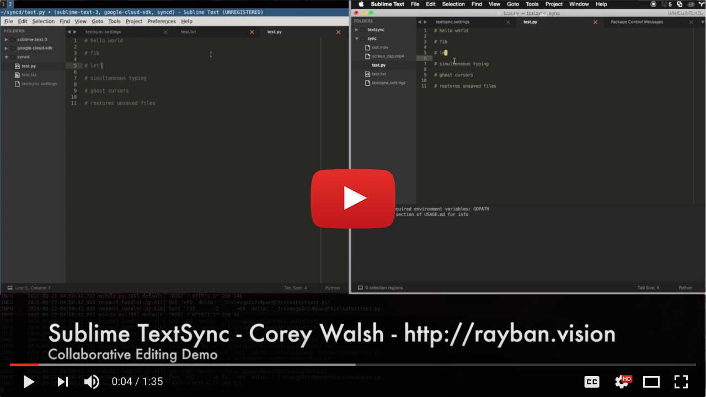

## Sublime TextSync (beta)

A Sublime Text plugin for real-time collaboration for Sublime Text over the internet. Google docs style n-user simultaneous
editing, powered by [Google diff-match-patch](https://code.google.com/p/google-diff-match-patch/). Supports ghost cursors
to show where other editors are working. Supports multiple cursors!

This is currently in beta, with no guarantees of security or good user experience. MAKE SURE TO KEEP BACKUPS OF IMPORTANT FILES. This hopefully shouldn't delete/wipe your synced files (don't worry, it won't mess with non-synced files), but be prepared just in case. I recommend using git along side TextSync. See [http://rayban.vision/#!/projects/sublime-textsync](http://rayban.vision/#!/projects/sublime-textsync) for more info!

### Demo

This is still a work in progress, but importantly - *it works*. It's taken me a while to release STS, primarily due to life getting in the way of me adding all the features I would like to. Given how long this process has taken, I have decided to expedite things by throwing it out there as is. Life permitting, I plan to clean up the existing code to debugify the existing features, and add a few more features to make the user experience better. For now, here's an early beta version provided AS-IS.

## Plugin Installation

1. **Copy the source directory to the new folder [your Sublime Text packages directory]/textsync** -> [Sublime Text config folder]/Packages/textsync/textsync.py should exist once this step is done 
2. **Move or copy textsync/example_config/textsync.sublime-settings to [sublime text packages folder]/User/textsync.sublime-settings** Follow the instructions below to configure your settings file.
3. **Reload Sublime Text** 

If installation goes well, you should see a variety of non-greyed out options under 'Tools > TextSync'.

## Running the server

To synchronize files, we first need to set up the central [DMP](https://code.google.com/p/google-diff-match-patch/) server which is bundled with Sublime TextSync. This server is not uber-secure, so run this on a computer in your local network that is not directly accessible to the outside world. If you need remote access, then run it on the inside of a VPN.

**Note:** this installation flow is a work in progress.

**1. Install the appengine development server**

[Download and install the SDK for App Engine](https://cloud.google.com/appengine/docs/python/download) - this provides a development server that will let you run the TextSync version of the diff-match-patch server.

**2. Run the development server**

Once you have appengine installed, run the dev server. On my desktop machine with a static IP address, the command is:

	$ cd /[Sublime Text Packages Directory]/User/textsync/server/appengine
	$ /[Google Cloud SDK install location/bin/dev_appserver.py \\
	   --port=9998 --admin_port=8001 --api_port=64494 --host=[my static IP address] app.yaml

**Note:** You should see a lot of output in the development server log when clients correctly connect. If you do not see this, then chances are you need to do a bit of debugging to make sure the development server is accessible from your clients, and all the configuration URLs are correctly set. The server should print out a few key internet addresses when started, check to see if those are accessible from your clients. 

There is preliminary support for starting the server from the menu options of Sublime TextSync, but they are not yet robust enough to be considered reliable.

## Syncing a directory

Once the plugin is installed, and the server is running, all that's left to do is to add a configuration folder with the files you want to sync. Copy this configuration file over to all the computers you want to edit with. In both clients, create a file that you want to edit which matches the "include" blob, and open it (this setup flow should be improved eventually). Make sure that all your clients have different usernames, or you will enter undefined behavior land. The "id" field is appended to the filename in the diff-match-patch server, so make sure it's consistent across all clients.

    {
        "exclude": [        
            "**/__init__.py"        
        ],        
        "include": [        
            "*.txt",        
            "*.py"        
        ],       
        "username": "YOUR-UNIQUE-USERNAMES",        
        "send_ghost_cursors": true,        
        "show_ghost_cursors": true,        
        "gateway": "http://[my server IP]:9998",        
        "id": "thisisatest"
    }

Enable synchronization by clicking 'Tools > TextSync > Enable Synchronization' in Sublime. Open the synced files and if all has gone well, the text should sync across all clients.

## Troubleshooting:

As this is very beta, getting set up might take a bit of troubleshooting. One thing that can help is enabling "debug": true in the settings file, and opening up the Sublime console with 'View > Show Console'.

**Greyed out menu options/Weird issues:** Try saving the file called "textsync.py" and then the file called "commands.py" in the plugin source directory. This will trigger a plugin reload. Don't do this with any shared files open.

**Trouble connecting to the server:** Try using nmap on your server's IP address from the client machine, this should help pinpoint firewall/network issues.

## Known bugs

- File initialization is a bit wonky in new clients, works best if you initialize a new client at the current file state
- Small lag in updating ghost cursor ranges on edits, does not cause cursor position loss
- Collaboration interference if your edits are too close to someone else's
- Some of the menu options don't totally work yet
- [I have more written on a list somewhere]

## TODO

- More documentation
- A round of general debugging
- More commands - make it easier to control without manually editing config files
- Easier onboarding and installation

## Questions?

If you really want to give this a try, but have issues with the install? Thoughts, suggestions? [Drop me a line](http://rayban.vision/#!/contact) and I'll try to get back with you. Please include any relevant error messages, and a description of the problems you're having.